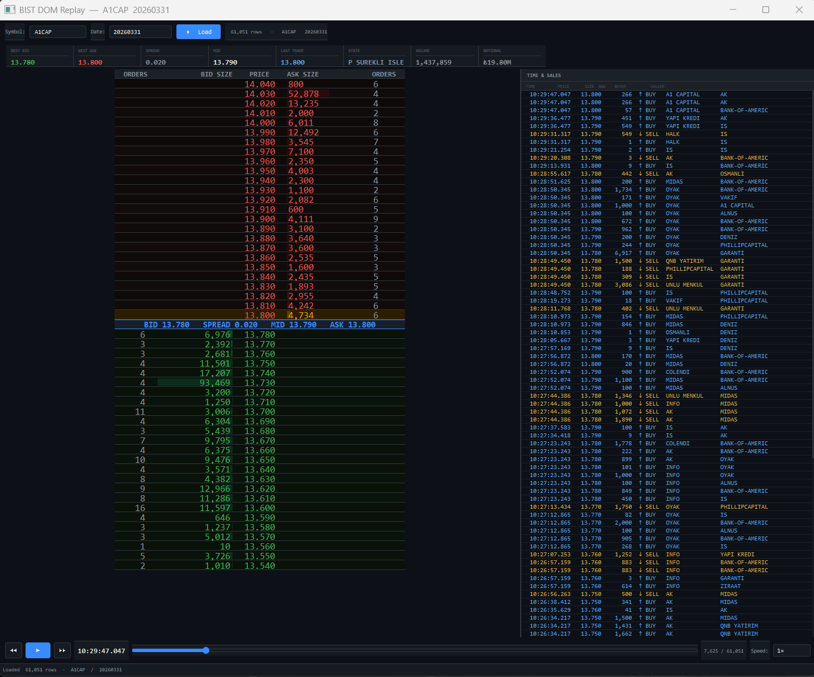

# BIST DOM Replay

A professional **25-Level Depth of Market (DOM) ladder** replay tool for BIST (Borsa Istanbul) ITCH/MTX market data. Visualizes order book depth, spread, and trade tape with smooth ~60 fps playback from enriched Parquet files.


---



---

## Features

- **25-level bid/ask ladder** — custom-painted with color-coded quantity bars
- **Flash animations** — highlights price levels that changed quantity or were hit by a trade
- **Trade tape (Time & Sales)** — live scrolling list of executions with side, size, buyer/seller broker IDs
- **Summary bar** — best bid/ask, spread, mid, last trade, session volume, and notional (₺)
- **Playback controls** — play/pause, step forward/back, variable speed (0.1× to 100×), seekable slider
- **Keyboard shortcuts** — `Space` play/pause, `←` step back, `→` step forward
- **Dark terminal-style UI** — monospace font, dark palette throughout

---

## Data Format

The app reads **Parquet files** organized in a Hive-partitioned directory structure:

```
<DATA_ROOT>/
  symbol=AKBNK/
    date=2024-01-15/
      data.parquet
    date=2024-01-16/
      data.parquet
  symbol=GARAN/
    ...
```

### Required Parquet Columns

| Column | Type | Description |
|---|---|---|
| `timestamp` | datetime64 | Event timestamp |
| `decimals_price` | int | Decimal places for price formatting |
| `bid_p1` … `bid_p25` | float | Bid price levels (1 = best) |
| `bid_q1` … `bid_q25` | int | Bid quantity at each level |
| `bid_c1` … `bid_c25` | int | Bid order count at each level |
| `ask_p1` … `ask_p25` | float | Ask price levels (1 = best) |
| `ask_q1` … `ask_q25` | int | Ask quantity at each level |
| `ask_c1` … `ask_c25` | int | Ask order count at each level |
| `itch_trade_price` | int | Raw trade price (integer, scaled by 10^decimals) |
| `itch_exec_qty` | int | Executed quantity |
| `itch_side` | str | Aggressor side (`S` = buyer lifted ask, `B` = seller hit bid) |
| `notional` | float | Trade notional value in ₺ |
| `state_name` | str | Market state (e.g. `CONTINUOUS_TRADING`) |
| `buyer` / `buyer_broker_id` | str | Buyer broker identifier |
| `seller` / `seller_broker_id` | str | Seller broker identifier |

Columns that are absent or null are handled gracefully — only `timestamp` is strictly required.

---

## Installation

### Prerequisites

- Python 3.10 or newer
- Windows (tested on Windows 10/11)

### Quick Start (Recommended)

Double-click **`setup_and_run.bat`**. It will:

1. Verify Python and pip are available
2. Install all dependencies from `requirements.txt`
3. Verify imports
4. Launch the application

### Manual Installation

```bash
pip install PyQt5 pandas pyarrow numpy
python bist_dom_replay.py
```

---

## Configuration

Open `bist_dom_replay.py` and edit the constants near the top of the file:

```python
DATA_ROOT         = r"D:\BIST_ITCH_MTX_PIPELINE_DATA\output\enriched\market_depth_hive"
LEVELS            = 25          # number of DOM levels to display
MAX_TAPE          = 1000        # max rows kept in the trade tape
TIMER_MS          = 16          # playback timer interval (~60 fps)
MAX_ROWS_PER_TICK = 500         # max data rows processed per timer tick
```

Set `DATA_ROOT` to the root of your Hive-partitioned Parquet dataset.

---

## Usage

### Loading Data

1. Launch the app (`setup_and_run.bat` or `python bist_dom_replay.py`)
2. Type or select a **symbol** in the Symbol dropdown (e.g. `AKBNK`)
3. Select a **date** from the Date dropdown (populated automatically)
4. Click **`⏵ Load`**

The status bar shows row count and confirms the file loaded.

### Playback Controls

| Control | Action |
|---|---|
| `▶` / `⏸` button | Play / Pause |
| `◀◀` button | Step one row back |
| `▶▶` button | Step one row forward |
| Slider | Seek to any position in the session |
| Speed dropdown | Set replay speed: `0.1×` `0.25×` `0.5×` `1×` `2×` `5×` `10×` `50×` `100×` |

### Keyboard Shortcuts

| Key | Action |
|---|---|
| `Space` | Play / Pause |
| `←` | Step one row back |
| `→` | Step one row forward |

### Reading the DOM Ladder

```
┌─────────┬──────────────┬──────────────┬──────────────┬─────────┐
│ ORDERS  │   BID SIZE   │    PRICE     │   ASK SIZE   │ ORDERS  │
├─────────┼──────────────┼──────────────┼──────────────┼─────────┤
│         │              │  ask_p25     │ ████ qty     │  cnt    │  ← farthest ask
│         │              │  ...         │              │         │
│         │              │  ask_p1      │ ████████ qty │  cnt    │  ← best ask
├─────────┴──────────────┴──────────────┴──────────────┴─────────┤
│          BID 12.34   SPREAD 0.02   MID 12.35   ASK 12.36       │  ← spread row
├─────────┬──────────────┬──────────────┬──────────────┬─────────┤
│  cnt    │ qty ████████ │  bid_p1      │              │         │  ← best bid
│  cnt    │ qty ████     │  ...         │              │         │
│         │              │  bid_p25     │              │         │  ← farthest bid
└─────────┴──────────────┴──────────────┴──────────────┴─────────┘
```

- **Green rows** = bids, **Red rows** = asks
- **Bar width** scales with quantity relative to the largest level in the current snapshot
- **Top 3 best levels** use a brighter bar color
- **Flash green** = bid quantity changed
- **Flash red** = ask quantity changed
- **Flash orange** = a trade was executed at that price level

### Reading the Trade Tape

```
  TIME          PRICE       SIZE  AGG    BUYER           SELLER
  09:31:42.14   12.3400     5,000  ↑ BUY   0105            0220
  09:31:41.88   12.3200    12,500  ↓ SELL  0220            0105
```

- `↑ BUY` (blue) — aggressive buyer lifted the ask (`itch_side = S`)
- `↓ SELL` (yellow) — aggressive seller hit the bid (`itch_side = B`)
- Most recent trade is always at the top
- Up to 1,000 trades are kept in the tape; older ones are discarded

### Summary Bar

| Field | Description |
|---|---|
| BEST BID | Top-of-book bid price |
| BEST ASK | Top-of-book ask price |
| SPREAD | Ask − Bid |
| MID | (Ask + Bid) / 2 |
| LAST TRADE | Most recent execution price |
| STATE | Market state string |
| VOLUME | Cumulative executed shares from session start (or seek point) |
| NOTIONAL | Cumulative turnover in ₺ |

> **Note:** Volume and Notional are cumulative from the beginning of the loaded session (or from the seek position if you dragged the slider).

---

## Project Structure

```
bist_data_UI/
├── bist_dom_replay.py    # main application
├── setup_and_run.bat     # one-click installer + launcher (Windows)
├── requirements.txt      # Python dependencies
└── README.md
```

---

## Dependencies

| Package | Purpose |
|---|---|
| `PyQt5` | UI framework |
| `pandas` | DataFrame loading and timestamp handling |
| `pyarrow` | Parquet file reading |
| `numpy` | Numerical utilities |

---

## Troubleshooting

**App opens but shows no symbols**
- Check that `DATA_ROOT` in the script points to your actual data directory
- The directory must contain subdirectories named `symbol=<TICKER>`

**`FileNotFoundError` or "File not found" dialog**
- Verify the Parquet file exists at `<DATA_ROOT>/symbol=<SYM>/date=<DATE>/data.parquet`

**Playback is choppy at high speed**
- Reduce `MAX_ROWS_PER_TICK` or increase `TIMER_MS` in the constants section

**DOM ladder appears very small or clipped**
- Resize the window or drag the splitter handle between the DOM and the tape panel

**`ImportError: No module named 'PyQt5'`**
- Run `setup_and_run.bat` or manually run `pip install PyQt5 pandas pyarrow numpy`

---

## License

MIT
